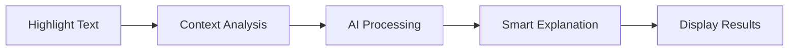

# 🔍 Contextual - AI-Powered Text Explanations

[](https://chrome.google.com/webstore)
[](https://openrouter.ai/)
[](LICENSE)

> 🚀 **Stop context-switching!** Get instant, AI-powered explanations for any text you highlight, without leaving the page you're reading.

---

## ✨ What is Contextual?

**Contextual** is a Chrome extension that brings intelligent text explanations directly to your browser. Whether you're reading technical documentation, research papers, or blog posts, simply highlight any word or phrase to get a context-aware explanation powered by state-of-the-art AI models.

### 🎯 The Problem It Solves

- **No more tab switching** - Stop interrupting your reading flow to search for definitions
- **Context matters** - Get explanations that understand the specific domain and context of what you're reading
- **One-click simplicity** - Highlight text → Click icon → Get explanation
- **Privacy-focused** - Your API key stays local, no data sent to third parties

---

## 🌟 Key Features

| Feature | Description |
|---------|-------------|
| 🎯 **Context-Aware** | Analyzes the entire article to provide domain-specific explanations |
| ⚡ **Instant Results** | Get explanations in under 3 seconds |
| 📚 **Dual Modes** | Choose between **Simple** (beginner-friendly) or **Technical** (detailed) explanations |
| 🔒 **Privacy First** | Your API key is stored locally and never shared |
| 🤖 **AI-Powered** | Leverages OpenRouter's advanced language models |
| 📱 **Non-Intrusive** | Clean sidebar interface that doesn't disrupt your reading |
| 💾 **Smart Caching** | Avoids redundant API calls for better performance |

---

## 🚀 Quick Start Guide

### Step 1: Installation

#### Option A: From Chrome Web Store (Coming Soon)
*Extension will be available on the Chrome Web Store soon.*

#### Option B: Load as Developer Extension

1. **Download the extension**
   ```bash
   git clone https://github.com/PJ2005/contextual.git
   # or download ZIP from GitHub
   ```

2. **Load into Chrome**
   - Open Chrome and go to `chrome://extensions/`
   - Enable **"Developer mode"** (toggle in top-right)
   - Click **"Load unpacked"** and select the `contextual` folder

3. **Pin the extension** (recommended)
   - Click the puzzle piece icon in Chrome toolbar
   - Click the pin 📌 next to "Contextual"

### Step 2: Configuration

#### Get Your OpenRouter API Key

1. Visit [OpenRouter.ai](https://openrouter.ai/) and create a free account
2. Go to [API Keys](https://openrouter.ai/keys) and generate a new key
3. Copy your API key (starts with `sk-or-`)

#### Configure the Extension

1. **Click the Contextual icon** in your Chrome toolbar
2. **Enter your API key** in the popup window
3. **Choose a model** (recommended: `deepseek/deepseek-chat-v3-0324`)
   - Browse available models at [OpenRouter Models](https://openrouter.ai/models)
   - Free tier models available for testing
4. **Click "Save"** - You'll see a success message

> 💡 **Pro Tip**: Your configuration is saved permanently and syncs across Chrome devices!

### Step 3: Start Using

1. **Navigate to any webpage** with text content
2. **Highlight any text** you want explained
3. **Click the circular icon** that appears next to your selection
4. **Choose explanation style**:
   - 🟢 **Simple**: Easy-to-understand, beginner-friendly explanations
   - 🔵 **Technical**: Detailed, domain-specific technical explanations
5. **Read the explanation** in the sidebar that opens

---

## 📖 Usage Examples

### Example 1: Technical Documentation
Reading about gRPC and confused about "client stub"?
- **Highlight**: "client stub"
- **Get**: Context-aware explanation specific to gRPC technology

### Example 2: Research Papers
Encountered "transformer architecture" in an AI paper?
- **Highlight**: "transformer architecture"
- **Get**: Explanation tailored to machine learning context

### Example 3: News Articles
Don't understand "blockchain consensus" in a crypto article?
- **Highlight**: "blockchain consensus"
- **Get**: Simple explanation with real-world analogies

---

## ⚙️ How It Works



1. **Content Detection**: Extension detects text selection on any webpage
2. **Context Extraction**: Analyzes surrounding content and article domain
3. **AI Processing**: Sends context + selection to OpenRouter's AI models
4. **Smart Response**: AI provides domain-specific, contextually relevant explanation
5. **Clean Display**: Shows explanation in non-intrusive sidebar

---

## 🛠️ Technical Architecture

| Component | Purpose |
|-----------|---------|
| `content.js` | Detects text selections and manages UI elements |
| `background.js` | Handles API communication and context analysis |
| `explanation.js` | Manages the explanation sidebar interface |
| `popup.js` | Handles extension configuration and settings |

---

## 🔧 Configuration Options

### Supported Models

| Model | Provider | Speed | Quality | Cost |
|-------|----------|-------|---------|------|
| `deepseek/deepseek-chat-v3-0324` | DeepSeek | ⚡⚡⚡ | ⭐⭐⭐⭐ | 💰 |
| `openai/gpt-4o-mini` | OpenAI | ⚡⚡ | ⭐⭐⭐⭐⭐ | 💰💰 |
| `anthropic/claude-3-haiku` | Anthropic | ⚡⚡⚡ | ⭐⭐⭐⭐ | 💰💰 |

### Explanation Styles

- **Simple Mode**: 20-100 words, analogies, beginner-friendly language
- **Technical Mode**: Detailed definitions, implementation details, technical context

---

## 🔒 Privacy & Security

- ✅ **Local Storage**: API keys stored locally in Chrome, never transmitted
- ✅ **No Tracking**: Extension doesn't track your browsing or selections
- ✅ **Secure Communication**: Direct HTTPS connection to OpenRouter
- ✅ **Open Source**: Full code available for audit on GitHub

---

## 🐛 Troubleshooting

### Common Issues

| Issue | Solution |
|-------|----------|
| "No auth credentials found" | Check API key is correctly entered and valid |
| Extension icon not showing | Refresh page and try selecting text again |
| Slow responses | Try a different model or check internet connection |
| Invalid API key error | Verify key starts with `sk-or-` and is active |

### Getting Help

1. **Check Console**: Press F12 → Console tab for error details
2. **GitHub Issues**: Report bugs at [GitHub Issues](https://github.com/PJ2005/contextual/issues)
3. **Documentation**: Visit [OpenRouter Docs](https://openrouter.ai/docs) for API questions

---

## 🤝 Contributing

We welcome contributions! Please check our [Contributing Guidelines](CONTRIBUTING.md) for details.

### Development Setup

```bash
# Clone repository
git clone https://github.com/PJ2005/contextual.git
cd contextual

# Load extension in Chrome
# Go to chrome://extensions/ → Developer mode → Load unpacked
```

### Sharing the Extension

#### For End Users
1. **Direct Download**: Share the [GitHub repository link](https://github.com/PJ2005/contextual)
2. **ZIP Distribution**: Create a ZIP file and share directly
3. **Chrome Web Store**: *Coming soon - under review*

#### Installation Instructions for Recipients
1. Download/clone this repository
2. Open Chrome and go to `chrome://extensions/`
3. Enable "Developer mode" (toggle in top-right)
4. Click "Load unpacked" and select the extension folder
5. Get your OpenRouter API key from [OpenRouter.ai](https://openrouter.ai/)
6. Click the extension icon and configure your API key

---

## 📄 License

This project is licensed under the MIT License - see the [LICENSE](LICENSE) file for details.

---

## 🙏 Acknowledgments

- **[OpenRouter](https://openrouter.ai/)** for providing access to state-of-the-art language models
- **Chrome Extensions API** for enabling seamless browser integration
- **The Open Source Community** for inspiration and feedback

---

<div align="center">

**Made with ❤️ for developers, researchers, and curious minds**

[⭐ Star on GitHub](https://github.com/PJ2005/contextual) • [🐛 Report Bug](https://github.com/PJ2005/contextual/issues) • [💡 Request Feature](https://github.com/PJ2005/contextual/issues)

</div>
